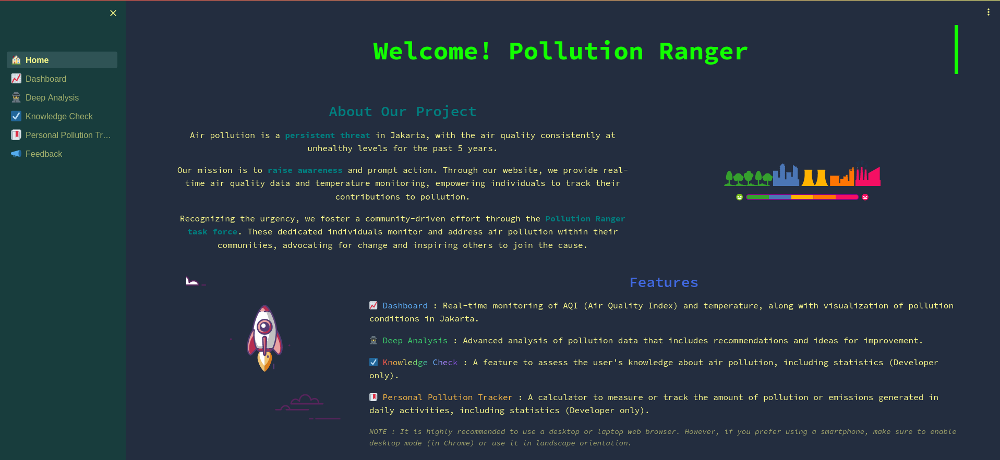

# AirWise Jakarta - Capstone Project

## Overview

AirWise Jakarta is a Data Analyst Capstone Project focusing on SDG 11.6, addressing air pollution in Jakarta.

## Features

- **Real-time Monitoring:** Live updates on Air Quality Index (AQI) and temperature.
- **Historical Trends and Forecast:** Analysis of air pollution trends and one-year forecast.
- **Pollutant Composition:** Insights into pollutants and their impacts.
- **Correlation Analysis:** Explore AQI correlations with traffic, weather, and public perception.
- **Public Engagement Portal:** Report environmental issues and engage in discussions.
- **Knowledge Check & Tracker:** Enhance awareness and track personal pollution contributions.

## Project Team

- **Team Leader:** [Septian Panjaya](https://www.linkedin.com/in/septian-panjaya)
- **Team Member:** [Katon Bagaskara](https://www.linkedin.com/in/katonbk)

## Acknowledgments

Special thanks to Coach [I Wayan Nadiantara](https://www.linkedin.com/in/nadiantara) for his invaluable guidance.

## Project Demo

Explore the AirWise Jakarta project [here](https://bit.ly/pollution-dashboard).

Watch the demo video [here](https://drive.google.com/file/d/1e_b647M-W4aRiCjvVwyJasXxdFm0WZWp/view?usp=sharing).

## Usage

Refer to the project documentation for usage guidelines.

---

Thank you for contributing to cleaner and healthier cities!
